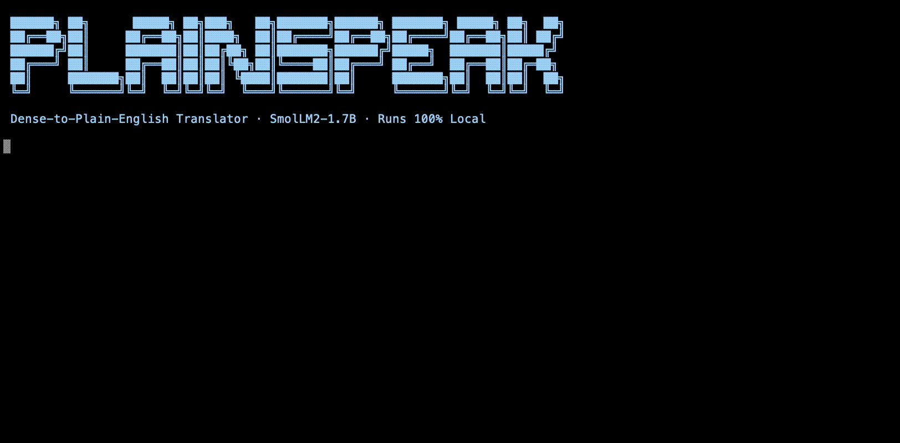

<div align="center">

<br />

# PlainSpeak

### *I taught a tiny AI to speak human.*



Give it Shakespeare. Give it a legal contract. Give it anything written to impress instead of communicate.  
It gives you back what it actually means.

<br />

[](https://huggingface.co/Brandi-Kinard/plainspeak-smollm2-1.7b)
[](https://github.com/ml-explore/mlx)
[](https://github.com/Brandi-Kinard/plainspeak)
[](https://github.com/Brandi-Kinard/plainspeak)
[](LICENSE)

<br />

</div>

---

## The idea

Language is power. Dense, archaic, jargon-heavy text isn't just hard to read — it's a wall. It keeps people out of contracts they're signing, bills their city is passing, papers that affect their health, books that were written for them but feel like they weren't.

PlainSpeak tears down the wall.

It's a small language model — 1.7B parameters — fine-tuned on 1,500 curated pairs of dense text and its plain English equivalent. It was built in one evening, on an M1 Mac, for roughly $3 in API calls. No cloud. No GPU farm. No permission from anyone.

It doesn't try to do everything. It does one thing better than models ten times its size: **it makes language human again.**

---

## See it work

**Shakespeare → Plain English**

```
Original:   "It is a truth universally acknowledged, that a single man in
             possession of a good fortune, must be in want of a wife."

PlainSpeak: "Everyone agrees that a rich single man must be looking for a wife."
```

**Shakespeare (Romeo & Juliet) → Plain English**

```
Original:   "Wherefore art thou Romeo? Deny thy father and refuse thy name;
             Or, if thou wilt not, be but sworn my love,
             And I'll no longer be a Capulet."

PlainSpeak: "Why are you Romeo? Don't deny your father and refuse your name.
             If you won't, promise to love me, and I won't be a Capulet anymore."
```

**Adam Smith → Plain English**

```
Original:   "The invisible hand of the market, whereby individuals pursuing
             their own self-interest are led, as if by an invisible hand,
             to promote ends which were no part of their original intention."

PlainSpeak: "When people try to make money for themselves, they often end up
             helping society without meaning to. It's like an invisible hand
             is guiding them to do what's best for everyone."
```

---

## Run it in 60 seconds

```bash
pip install mlx-lm
```

```bash
mlx_lm.generate \
  --model Brandi-Kinard/plainspeak-smollm2-1.7b \
  --prompt "### Original:
YOUR TEXT HERE

### Plain English:" \
  --max-tokens 200
```

That's it. The model downloads once (~3.4GB), then runs entirely on your machine. No API key. No account. No data leaves your device.

---

## Use it in Python

```python
from mlx_lm import load, generate

model, tokenizer = load("Brandi-Kinard/plainspeak-smollm2-1.7b")

prompt = """### Original:
Notwithstanding any other provision of this Agreement, either party may 
terminate this Agreement upon written notice if the other party materially 
breaches any provision hereof.

### Plain English:"""

response = generate(model, tokenizer, prompt=prompt, max_tokens=200)
print(response)
# → "Either side can cancel this agreement in writing if the other side
#    seriously breaks any of its rules."
```

---

## How it was built

No magic. Just a clean pipeline anyone can reproduce.

```
1. Stream 1,500 prose passages from Project Gutenberg
        ↓
2. Send each passage to a frontier model as the "teacher"
   Prompt: "Rewrite this so a 16-year-old understands it.
            Same meaning. Short sentences. No fancy words."
        ↓
3. Save 1,500 (original → plain) pairs as training data
        ↓
4. Fine-tune SmolLM2-1.7B with LoRA on Apple MLX
   Hardware: M1 Mac 16GB  |  Time: ~20 min  |  Peak memory: 10GB
        ↓
5. Fuse adapter into final weights. Ship.
```

**The key insight:** A small model trained on 1,500 *perfect* examples outperforms a large model trained on millions of noisy ones — at this specific task. This is the Microsoft Phi finding applied in practice, not in theory.

---

## Model card

| Property | Value |
|---|---|
| Base model | SmolLM2-1.7B-Instruct |
| Fine-tuning method | LoRA (8 layers) |
| Training iterations | 500 |
| Training examples | 1,200 (80/10/10 split) |
| Data source | Project Gutenberg + AI-generated synthetic pairs |
| Hardware | Apple M1, 16GB unified memory |
| Peak training memory | 10.09 GB |
| Final val loss | 1.771 |
| Inference memory | ~3.6 GB |
| Build time | 1 evening |
| Build cost | ~$3 USD |

---

## What it's good at

- ✅ 19th century prose (Dickens, James, Eliot, Hardy)
- ✅ Shakespeare and Elizabethan English
- ✅ Economic and political theory (Smith, Burke, Locke)
- ✅ Academic abstracts
- ✅ Legal boilerplate
- ✅ King James Bible passages

## Known limitations

- ❌ Struggles with very short fragments (trained on 200-word chunks)
- ❌ Occasional factual errors on numerical content (dates, quantities)
- ❌ Not optimized for highly technical scientific notation
- ❌ No real-time API endpoint yet

---

## Part of a larger build

This is Sprint 1 of a series of focused, locally-run AI models built to prove that small, precise models can outperform giant cloud models at specific tasks — built on a laptop, with no external funding.

| Sprint | Model | Status |
|---|---|---|
| 1 | **PlainSpeak** — Dense-to-plain-English translator | ✅ Shipped |
| 2 | **CivicDigest** — Local government meeting summarizer | 🔨 Next |
| 3 | **SafeCheck** — Food + drug safety checker | ⏳ Upcoming |
| 4 | **CarDiag** — OBD-II car diagnosis advisor | ⏳ Upcoming |

Follow the build: [linkedin.com/in/brandi-kinard](https://www.linkedin.com/in/brandi-kinard/)

---

## Repo structure

```
plainspeak/
├── data/
│   ├── raw/                        # Gutenberg passages
│   ├── processed/                  # AI-generated pairs
│   ├── train/train.jsonl           # Training split (1,200 examples)
│   ├── valid/valid.jsonl           # Validation split (150 examples)
│   └── test/test.jsonl             # Test split (150 examples)
├── adapters/                       # LoRA adapter weights
├── generate_pairs.py               # Step 1: pull Gutenberg passages
├── generate_training_pairs.py      # Step 2: frontier model as teacher
└── format_for_mlx.py               # Step 3: format for MLX training
```

---

## Reproduce it

```bash
git clone https://github.com/Brandi-Kinard/plainspeak
cd plainspeak
python3 -m venv venv && source venv/bin/activate
pip install mlx mlx-lm datasets anthropic

export ANTHROPIC_API_KEY="your-key-here"

python3 generate_pairs.py               # Pull 1,500 Gutenberg passages
python3 generate_training_pairs.py      # Generate pairs (~45 min, ~$3)
python3 format_for_mlx.py              # Format for training

mlx_lm.lora \
  --model mlx-community/SmolLM2-1.7B-Instruct \
  --train --data ./data \
  --iters 500 --batch-size 2 \
  --num-layers 8 --learning-rate 1e-4
```

---

<div align="center">

Built by [Brandi Kinard](https://www.linkedin.com/in/brandi-kinard/) — product designer turned AI builder.  
MFA Design & Technology, Parsons · BS Mechanical Engineering, Hofstra  
Previously: Meta Reality Labs · Microsoft 365 Copilot · LinkedIn · Atlassian

<br />

*"Own the brain. Stop renting intelligence from giants."*

</div>
